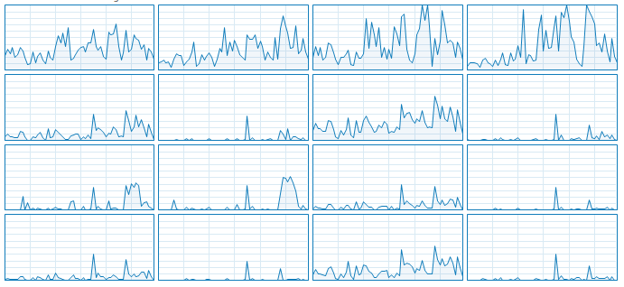
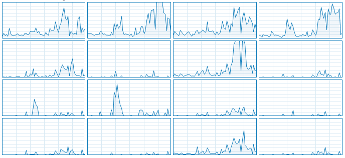

# ARSW-Lab02
## Concurrent programming, race conditions, and thread synchronization.

**Colombian School of Engineering Julio Garavito**  
**Software Architectures - ARSW**  
**Laboratory Number 2**

**Members:**
- Juan Esteban Medina Rivas
- María Paula Sánchez Macías

---

## Part I - PrimeFinder

*Creation, implementation, and coordination of threads.*

> We worked on a program that calculates prime numbers between two intervals, distributing the search for them among independent threads. At first, it has a single execution thread that searches for primes between 0 and 30,000,000. 
We had to execute it, open the operating system's process manager, and check how many cores are used by it.

The test is somewhat affected by native processes of the computer and operating system.

**Testing execution with just 1 thread:**

> We had to modify the program so that, instead of solving the problem with a single thread, it does so with three, each of which will do one-third of the original problem. Also, had to review the use of the computer's cores once more.

**Testing execution with 3 threads:**

> Lastly, we needed to modify the application so that 5 seconds after it starts running, all threads are stopped and the number of primes found so far is displayed. Then, wait for the user to press ENTER to resume execution.

**Testing with 30M**

\
**Testing with 100M**

---

## Parte II -  Galgo Racing

design of the program

>Upon starting the application, we identified a critical issue: **the results were displayed before the race actually finished**.

First, we found a mistake when running the program, the results are shown before the race finish.

We resolved this timing issue by implementing `.join()` method after the dog threads start their execution. This ensures that results are only displayed once all dogs have completed the race and a winner is determined.

In this way, the results are shown as long as all the greyhounds have finished the race and a winner is provided.

The results are displayed in the console.

>We identified the inconsistencies in their results by looking at the ranking shown in the console. From this, we identified the critical regions of the program.

**Some of the inconsistencies we found were:**

- test #1

- test #2

It is evident that there is no specific order for the final positions of the greyhounds, and many dogs end up with the same positions, so there is no certainty that the winner is the real winner.

**The critical region we determined was:**

Several threads can interrupt and modify the value of ultimaPosicionAlcanza, causing the inconsistencies identified earlier:

1. Multiple greyhounds with the same position
2. Duplicate positions
3. More than one winning greyhound

>We used **"synchronized"** to organize the threads so that they only enter our critical region once.

For this, we synchronized the variable of the arrival record, which was causing the problems, and we refactored the code for better organization.

We verified that everything works correctly.

>We implemented the pause and continue functionalities. With these, when ‘Stop’ is clicked, all the greyhound threads stop, and when ‘Continue’ is clicked, they resume the race.

For this, we set up a flag that indicates whether a greyhound is suspended or not, and by using mechanisms such as wait and notify, the new functional buttons were implemented.

This can be seen in the Galgo and MainCanodromo classes in the _“parte2”_ folder.

